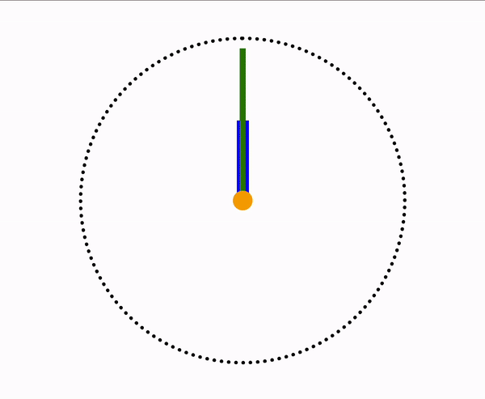

# Stop Watch

## 🎮 About the Project
A simple "Stop Watch" component with basic functionality (timer display).

## 🚀 Tech Stack
- **HTML** (BEM methodology for structured markup)
- **CSS** (Responsive & clean styles)
- **JavaScript** (Basic interactivity)

## 🛠️ Tools & Dependencies
- **ESLint** – Ensuring code quality
- **Prettier** – Code formatting for readability
- **Jest** – Unit testing framework
- **Parcel** – Bundler for fast development

## 📌 Features
✅ Timer display  
✅ Responsive design for both desktop and mobile  

## 🌐 Demo
🔗 [Live Demo](https://AndriiZakharenko.github.io/stop-watch/)

## 📸 Reference Image

## 📜 License
This project is forked from 💻 [Mate Academy](https://github.com/mate-academy/layout_stop-watch)
