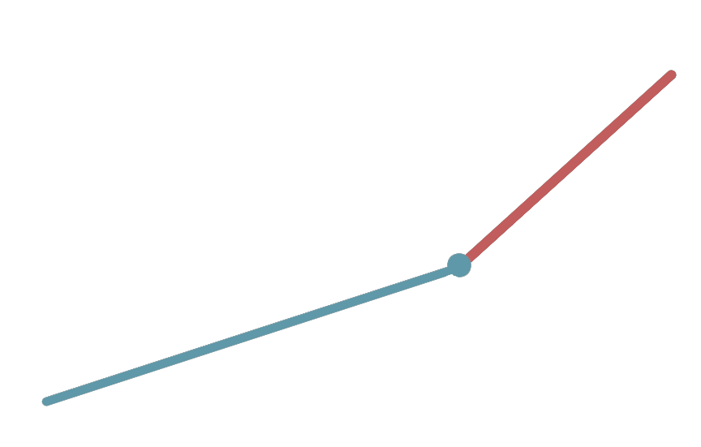

# Stopwatch task
Replace `<your_account>` with your Github username and copy the links to Pull Request description:
- [DEMO LINK](https://<your_account>.github.io/layout_stop-watch/)

___
> Follow [this instructions](https://github.com/mate-academy/layout_task-guideline#how-to-solve-the-layout-tasks-on-github)

- There are no tests for this task so don't run `npm test`
___

## ❗️❗️❗️ DON'T FORGET TO PROOFREAD YOUR CODE WITH [CHECKLIST](https://github.com/mate-academy/layout_stop-watch/blob/master/checklist.md) BEFORE SENDING YOUR PULL REQUEST❗️❗️❗️

## The task
Create a working stopwatch with minute and second hands using only CSS animations.
- There are no strict design you should follow for this task, you may choose on your own.
- The starting position of the hands should be at the top.
- Display a stopwatch in the center of the page.
- Demo has `80vmin` size
- For the demo purpose rotate hands during `5s` and `60s`

---

--> [CHECKLIST](https://github.com/mate-academy/layout_stop-watch/blob/master/checklist.md)
